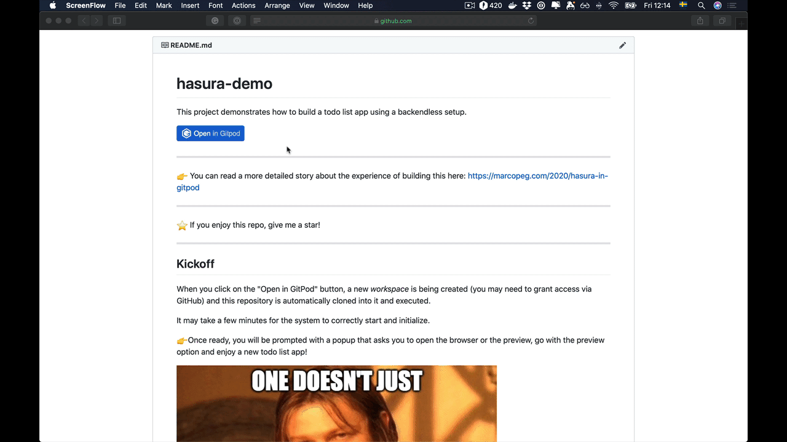

# hasura-demo

This project demonstrates how to build a todo list app using a
**backend-less** setup with [Hasura Engine](https://hasura.io/opensource/).

If you are eager to see it in action for free, just click the following button:

[](https://gitpod.io/#https://github.com/marcopeg/gitpod-hasura-demo)

And watch this gif-video to figure out what to expect (roughly):



---

👉 You can read a more detailed story about the experience of building this here:
https://marcopeg.com/2020/hasura-in-gitpod

---

⭐️ If you enjoy this repo, give me a star!

---

## Quick Start with GitPod

When you click on the "Open in GitPod" button, a new _workspace_ is
being created (you may need to grant access via GitHub) and this
repository is automatically cloned into it and executed.

> **It may take a few minutes for the system to correctly start and
> initialize.**

👉 Once ready, you will be prompted with a popup that asks you to open
the browser or the preview, go with the preview option and enjoy
a new todo list app!


This is NOT just a simple TodoList project, it has to run not one,
not two, ... but 6 services in order to give you the ability to
create a new todo:

- [PostgreSQL](https://www.postgresql.org) - the best database ever
- [Adminer](https://www.adminer.org) - database manager
- [Hasura Engine](https://hasura.io/docs/1.0/graphql/manual/index.html) - GraphQL Backend
- [Hasura Migrations CLI](https://hasura.io/docs/1.0/graphql/manual/migrations/index.html) - seeds the db and the Hasura settings
- String uppercasing - NodeJS backend
- [Webpack + CRA](https://reactjs.org/docs/create-a-new-react-app.html) - frontend server

It is so complicated on purpose just to prove the point that it is
possible to achieve a "one click startup" environment thanks to
[GitPod](https://gitpod.io) and similar Cloud IDE.

On top of it, this repository is also a personal starting point for other
fast-prototyping projects, check out the release versions to try out
older (and likely simpler) setups.

## Quick Start with Docker

If you prefer to run the application locally, you should clone the repo and then simply
run `docker-compose up`.

The backend will run on port `8080`.  
You can then easily enter the Hasura's console.

The frontend should run locally with NodeJS as the implementation through Docker may
be quite slow.

```bash
cd frontend && npm i && npm start
```

Enjoy,
Marco
